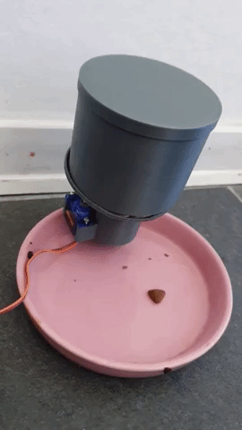
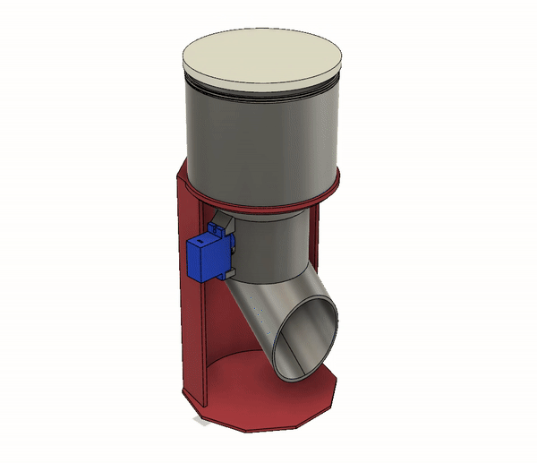
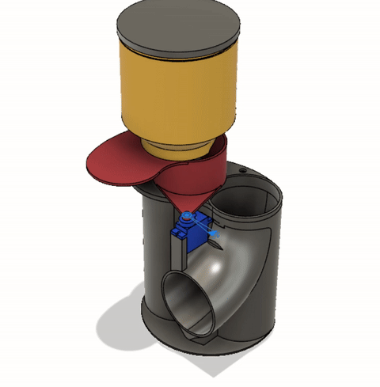
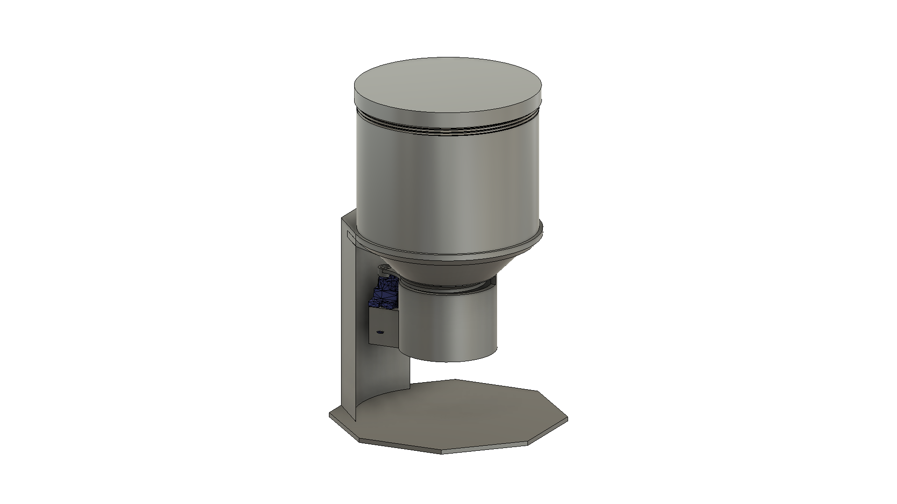

# Pet-Feeder
ESP8266 based Pet Feeder.

* This was more than a weekend project, took few designs to get it working, below few examples, being the last one the most successful one:

 

 

 

## Sumary

1. [PlatformIO](/README.md#PlatformIO)
2. [Hardware](/README.md#Hardware)
3. [Blynk](/README.md#Blynk)
4. [3D Printing](/README.md#3d-printing)
5. [Credits](/README.md#Credits)

## PlatformIO

* More information can be found on their comprehensive [Docs](https://docs.platformio.org/en/latest/ide/vscode.html). But Basically:

  0. Download and install official Microsoft Visual Studio Code. PlatformIO IDE is built on top of it
  1. **Open** VSCode Package Manager
  2. **Search** for official `platformio-ide` [extension](https://marketplace.visualstudio.com/items?itemName=platformio.platformio-ide)
  3. **Install** PlatformIO IDE.

## Hardware

### Servo

* Just using the cheap blue [SG90](https://www.google.com/search?client=firefox-b-d&q=sg90+servo):

### Board Pinout

## Blynk App

  

## 3D Printing

* You can find the 3D files [here](./3d%20files) or [https://www.thingiverse.com/thing:3776532](https://www.thingiverse.com/thing:3776532)

* Print seetings:
  * Anycubic I3 Mega;
  * PLA 195degC;
  * 0.25 resolution;
  * No support, (only the `gate` requires it);
  * 3 walls;
  * 20% Zigzag infill;

 

## Credits

*.gif created with [EZGIF.COM](https://ezgif.com/)

GitHub Shields and Badges created with [Shields.io](https://github.com/badges/shields/)
